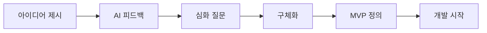

# 7. 실전 활용 팁
> 효과적인 AI 프롬프트 작성을 위한 가이드

---

## ✅ 효과적인 대화 흐름



---

## 📌 단계별 프롬프트 패턴

| 단계 | 프롬프트 유형 | 예시 |
|------|-------------|------|
| **탐색** | 아이디어 제시 | "이런 앱을 만들고 싶어" |
| **확장** | 가능성 탐색 | "다른 방향은 없을까?" |
| **구체화** | 기능 정의 | "이 기능을 어떻게 구현해?" |
| **차별화** | 경쟁력 분석 | "기존 앱과 차이점은?" |
| **MVP** | 범위 축소 | "최소 기능 버전을 만들어줘" |
| **실행** | 개발 시작 | "이제 코드로 만들어줘" |

---

## 💡 좋은 프롬프트의 특징

1. **구체적**: 막연한 요청보다 명확한 조건 제시
2. **맥락 포함**: 이전 대화 내용 참조
3. **목표 명시**: 왜 이것을 알고 싶은지 설명
4. **제약 조건**: 시간, 예산, 기술적 한계 언급
5. **예시 포함**: 참고할 만한 앱이나 서비스 언급

---

## 📝 템플릿: 완벽한 앱 아이디어 탐색 대화

```
[1단계: 아이디어 제시]
"나는 [A]와 [B]를 결합한 앱을 만들고 싶어.
타겟은 [누구]이고, [어떤 문제]를 해결하고 싶어."

[2단계: 피드백 요청]
"이 아이디어에 대해 어떻게 생각해?
강점, 약점, 시장성을 분석해줘."

[3단계: 심화 탐색]
"제안해준 [A 기능]을 어떻게 구현하면 좋을까?
기존 앱들과 차별화될 수 있는 포인트는?"

[4단계: MVP 정의]
"지금까지 논의한 내용으로 MVP를 정의해줘.
핵심 기능 3개와 개발 우선순위를 알려줘."

[5단계: 개발 시작]
"이제 MVP를 만들어줘. 
먼저 프로젝트 구조와 기술 스택을 설정하고,
핵심 기능부터 구현해나가자."
```

---

[← 이전: MVP 도출](./06_MVP_IDEATION.md) | [목차](./00_INDEX.md) | [다음: 유저 플로우 →](./08_USER_FLOW_REQUEST.md)

---

> 💡 **Remember**: 좋은 앱은 좋은 질문에서 시작됩니다!
