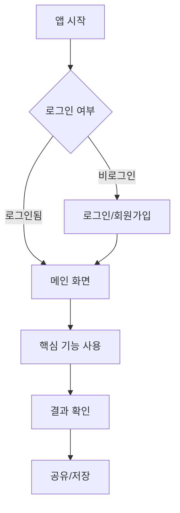

# 8. 핵심 유저 플로우 요청
> 사용자 경험 흐름을 설계하기 위한 프롬프트

---

## 🔄 기본 유저 플로우 요청

```
"우리 프로젝트의 핵심 유저 플로우를 단계별로 설명해줘."
```

---

## 📊 상세 유저 플로우 템플릿

```
"[프로젝트명]의 주요 유저 플로우를 작성해줘:

1. 온보딩 플로우
   - 앱 첫 진입 → 회원가입/로그인 → 초기 설정

2. 핵심 기능 플로우
   - [핵심 기능 1] 사용 단계
   - [핵심 기능 2] 사용 단계

3. 반복 사용 플로우
   - 일상적인 사용 패턴
   - 재방문 트리거

각 단계별로:
- 사용자 행동
- 시스템 반응
- 예상 소요 시간
을 포함해줘."
```

---

## 🎨 주요 기능 유저 플로우 설계

```
"우리 프로젝트의 주요 기능을 생각해서 주요 기능을 위한 유저 플로우를 설계해줘. 

사용자가 앱의 홈 화면에 진입할 때부터 주요 기능을 완료하고 
다시 홈 화면으로 돌아오기까지의 단계를 자세하게 설명해줘. 

각 단계에서 사용자가 어떤 행동을 하고 
어떤 화면을 보게 되는지 명확하게 알려줘."
```

**상세 버전:**
```
"[주요 기능명]의 전체 유저 플로우를 설계해줘:

시작점: 홈 화면

단계별 설명:
1. [화면 1] - 사용자 행동 / 시스템 반응
2. [화면 2] - 사용자 행동 / 시스템 반응
3. [화면 3] - 사용자 행동 / 시스템 반응
...
종료점: 홈 화면 복귀

각 단계에서:
- 화면 이름과 주요 UI 요소
- 사용자가 취할 수 있는 행동들
- 각 행동에 대한 시스템 반응
- 다음 화면으로 넘어가는 조건
- 에러 케이스와 처리 방법
을 포함해줘."
```

---

## 🎯 시나리오별 유저 플로우

```
"다음 시나리오에 대한 유저 플로우를 만들어줘:

시나리오 1: 신규 사용자가 처음 앱을 사용할 때
시나리오 2: 기존 사용자가 [핵심 기능]을 사용할 때
시나리오 3: 사용자가 다른 사용자와 상호작용할 때"
```

---

## 📱 화면 흐름 요청

```
"유저 플로우에 맞춰 필요한 화면 목록을 정리해줘.
각 화면에서 사용자가 할 수 있는 행동과 
다음 화면으로 넘어가는 조건을 포함해서."
```

---

## 🔍 유저 플로우 심화 질문

```
"이 유저 플로우에서 사용자가 이탈할 수 있는 지점은?"
"플로우를 단순화할 수 있는 방법은?"
"각 단계별 예상 전환율(Conversion Rate)은?"
```

---

## 📋 Mermaid 다이어그램 요청

```
"유저 플로우를 Mermaid 다이어그램으로 시각화해줘.
시작점에서 최종 목표까지의 흐름을 보여줘."
```

**예시 출력:**


---

[← 이전: 실전 팁](./07_PRACTICAL_TIPS.md) | [목차](./00_INDEX.md) | [다음: 수익 모델 →](./09_REVENUE_MODEL.md)
