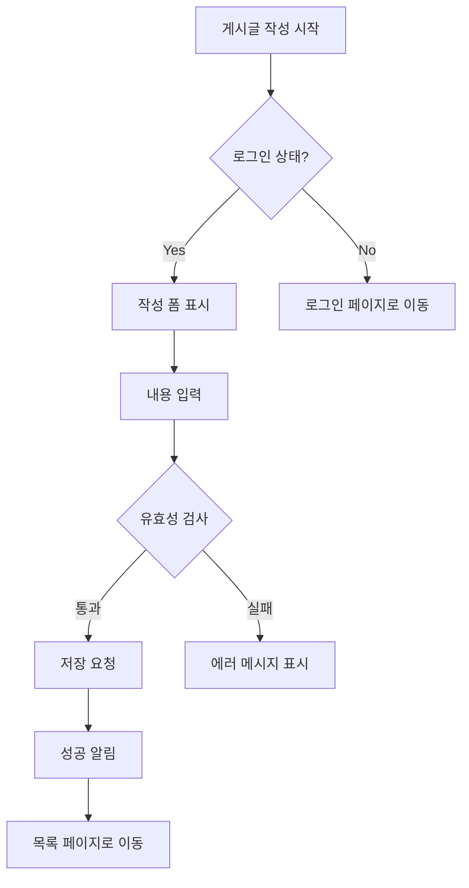

# 14. 주요 기능 상세 설계
> 핵심 기능을 구체적으로 정의하기 위한 프롬프트

---

## 📋 기능 명세 요청

```
"우리 앱의 주요 기능을 상세하게 정의해줘:

각 기능별로:
- 기능명
- 목적 및 사용자 가치
- 입력/출력 정의
- 비즈니스 로직
- 예외 처리
- 관련 화면

우선순위 (P0/P1/P2)도 함께 정해줘."
```

---

## 🎯 사용자 스토리 작성

```
"[기능명]에 대한 사용자 스토리를 작성해줘:

형식:
As a [사용자 유형],
I want to [원하는 기능],
So that [기대하는 가치].

수락 기준(Acceptance Criteria):
- Given [상황]
- When [행동]
- Then [결과]"
```

---

## 📊 기능 플로우차트

```
"[기능명]의 동작 흐름을 플로우차트로 만들어줘:

시작점 → 조건 분기 → 처리 → 결과

Mermaid 다이어그램으로 시각화해줘."
```

**예시:**


---

## 🔧 API 명세 요청

```
"[기능명]을 위한 API 명세를 작성해줘:

- Endpoint: /api/v1/[resource]
- Method: GET/POST/PUT/DELETE
- Request Body
- Response
- Status Codes
- 에러 케이스"
```

---

## 🗂️ 데이터 모델 설계

```
"[기능명]에 필요한 데이터베이스 스키마를 설계해줘:

Collection/Table 구조:
- 필드명
- 데이터 타입
- 필수 여부
- 기본값
- 관계 (references)

Firestore 또는 [DB]에 맞게 설계해줘."
```

---

## 🔒 권한 및 보안 요구사항

```
"[기능명]의 권한 및 보안 요구사항을 정의해줘:

- 접근 권한: 누가 사용할 수 있는가?
- 데이터 보호: 어떤 데이터가 민감한가?
- 검증: 어떤 입력을 검증해야 하는가?
- 감사: 어떤 행동을 로깅해야 하는가?"
```

---

[← 이전: 기능 구현](./13_FEATURE_IMPLEMENTATION.md) | [목차](./00_INDEX.md) | [다음: 테스트 →](./15_TESTING.md)
